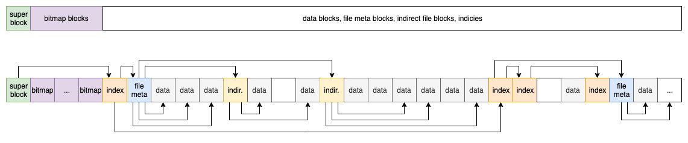

# Задание от 12.03.2019
Библиотека, реализующая файловую систему внутри файла-носителя.<br/>
Функционал решения:
* даёт возможность создать новый файл-носитель, которые содержит в себе данные файловой системы (ФС);
* подключать и отключать ФС;
* позволяет создавать и удалять именованные файлы внутри ФС;
* осуществляет многопоточный доступ на чтение каждого из файлов;
* осуществляет доступ на запись файла. 

## О решении
Данная реализация файловой системы (ФС) представляет собой файл в хост-ФС со специальной разметкой.

Объём "диска" разбивается на *блоки* – отрезки фиксированного размера. Блоки нумеруются от нуля. Номер блока – это его уникальный идентификатор в ФС. <br/>
Самый первый блок – *superblock* – содержит метаинформацию о ФС. Следом идёт группа *bitmap-блоков* – это битовая маска занятых/свободных блоков ФС. Далее вперемешку находятся блоки индексов, мета-блоки файлов и блоки данных файлов.

### Superblock
Это блок с номером 0; содержит метаинформацию о файловой системе. В данной реализации это только размер блока и номер блока с на вершиной индекса. Размер блока по умолчанию равен 1024 байт.

### Bitmap
Эти блоки служат для быстрого отслеживания свободных блоков, что необходимо для процесса аллокации блоков под записываемые данные. Если блок занят – бит установлен. Если блок свободен – бит равен 0.


Количество bitmap-блоков определяет размер ФС. В данной реализации принят размер в 1024 блока на bitmap. Это обеспечивает следующий размер ФС
```
1024 байт в блоке
* 8 бит в байте
* 1024 блоков на 1 bitmap-блок
* 1024
= 8 589 934 592 байт 
~ 8.59 ГБ
```
Однако, это требует bitmap размером в ~ 8.3 МБ. Искать линейно при каждой аллокации выходит слишком дорого, поэтому поиск осуществляется не по самому bitmap'у, а по дереву отрезков следующего вида

Данное дерево строится in-memory после монтирования ФС. Так как это дерево содержит постоянное количество элементов, его можно держать массивом, поэтому накладных расходов на указатели нет. Эта структура обеспечивает логарифмическое время поиска и обновления.

### Индексы
Реализован один индекс: B+-дерево по именам файлов, чтобы поиск файла занимал логарифмическое время. В листьях также хранятся номера FMB.<br/>
Из-за того что ключом в дереве выступает имя файла, оно ограничено 16 символами для простоты.

### File meta blocks, FMB
Это блок, содержащий мета-информацию о файле, а именно массив direct блоков с данными и массив indirect блоков с данными.
* Direct data block – блок с данными, номер которого хранится непосредственно в FMB.
* Indirect data block – блок с номерами блоков с данными. Номера таких indirect data block'ов хранятся в FMB.

Каждый FMB может хранить
* до 16 номеров direct-блоков;
* до 128 номеров indirect-блоков.
Это обеспечивает максимальный размер файла в
```
(
    16 direct-блоков
    + (
        128 indirect-блоков
        * 1024 байта на блок
        / 4 байта в номере блока
    )
)
* 1024 байта на блок
= 33 570 816 байт в файле
```

## О реализации
Репозиторий содержит 2 проекта:
* `Jbta.VirtualFileSystem` — библиотека, реализующая ФС.
* `Jbta.VirtualFileSystem.Tests` — набор интеграционных тестов на библиотеку.

Библиотека реализована на базе .NET Core 2.2.

### Зависимости
NuGet пакеты:
* [xUnit](https://www.nuget.org/packages/xunit/) — фреймворк для написания тестов.

Писалось, собиралось и тестировалось в JetBrains Rider 2018.3.4 на macOS Mojave 10.14.4.

### Библиотека
TODO

## Куда можно двигаться дальше?
Ниже перечислены меры, которые можно предпринять для улучшения текущего решения.
* Отказоустойчивость. Для сохранения консистентного состояния ФС после аварийного отключения потребуется реализация транзакционной системы и журналирования транзакций. Это весьма ресурсоёмкая задача.
* Возможность работы из нескольких процессов. Сейчас ФС монтируется лишь к одному процессу и безопасность работы с ней ограничена именно этим одним процессом. В реальной ситуации может потребоваться обеспечение доступа на чтение/запись файлов из нескольких процессов.
* Производительность. Здесь несколько моментов, о которых, однако, стоит говорить **только** после снятия профилей и тестов на производительность:
    * Понинизить количество обращений к файлу-носителю. Это должно привести к снижению количества дисковых операций. Для этого можно рассмотреть использовавание кэширования блоков файла/индекса/bitmap'а в память.
    * Сейчас работа с файлом закрыта RW-блокировкой, что означает, что паралелльно читать файл могут сколько угодно потоков-читателей, но писать может только один поток-писатель. Может оказаться полезным понизить гранулярность блокивки. Например, блокировать не файлами целиком, а наборами фиксированной длины из N блоков. Это позволит писать "параллельно" в разные части файла.
    * Замерить время, требуемое на аллокации в основной памяти при операциях над файлами. Возможно, по некоторым горячим путям можно сократить количество аллокаций.
* Вместительность.
    * Увеличить размер битовой маски.
    * В FMB добавить double indirect и triple indirect блоки.
    * Увеличить размер номера блока до беззнакового 32- или 64-разрядного значения.
* Директории. Для этого потребуется всего лишь расширить индекс и ввести ещё один вид мета-блоков – directory meta block (DMB), который будет содержать список файлов и номера FMB соответствующих файлов.
* Атрибуты файлов.
